# PDF Document Layout Analysis Workflow Analysis

## Executive Summary

This document provides a comprehensive analysis of the PDF document layout analysis system, focusing on the GPU-powered workflow for visualization and JSON output generation. The system implements a sophisticated deep learning pipeline using the VGT (Vision Grid Transformer) model with optimizations for NVIDIA A10G GPUs.

## System Architecture Overview

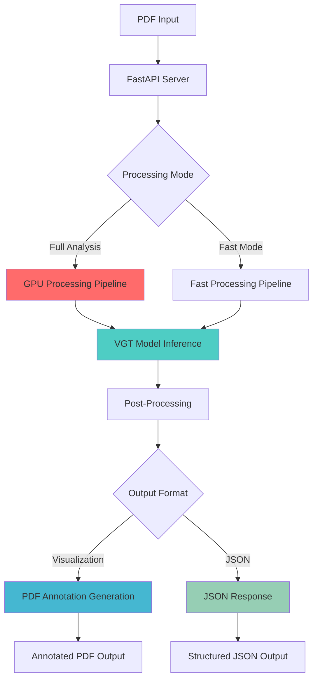

## Core Workflow Components

### 1. Entry Points and Server Architecture

The system provides multiple entry points optimized for different deployment scenarios:

- **Standard Application** (`src/app.py`): Basic FastAPI server with GPU synchronization
- **A10G Optimized Application** (`src/optimized_app.py`): Advanced batch processing with A10G-specific optimizations
- **Native A10G Server** (`a10g_server.py`): Direct deployment without Docker overhead

### 2. GPU Processing Pipeline

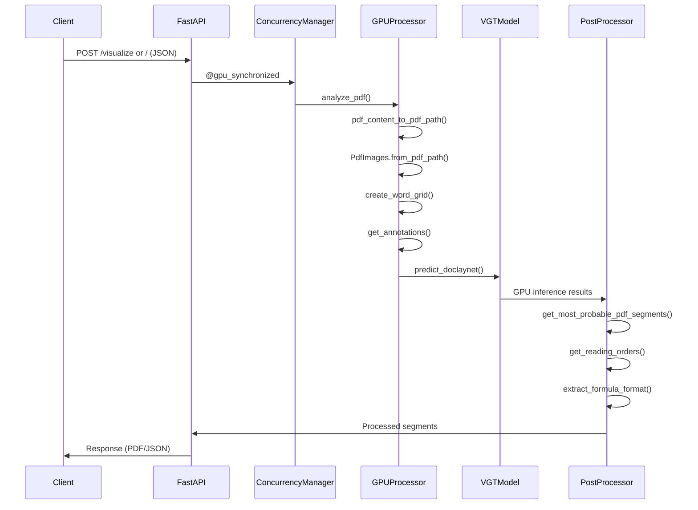

### 3. Data Flow Architecture

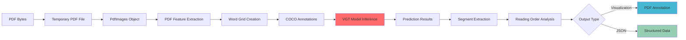

## Detailed Component Analysis

### 1. PDF Processing Pipeline (`run_pdf_layout_analysis.py`)

The core processing function `analyze_pdf()` follows this workflow:

1. **Input Processing**:
   - Converts PDF bytes to temporary file
   - Creates unique identifier for request isolation
   - Generates `PdfImages` object with feature extraction

2. **Feature Preparation**:
   - **Word Grid Creation**: Spatial text tokenization for VGT model
   - **COCO Annotation Generation**: Converts PDF features to COCO format
   - **Data Registration**: Registers dataset with Detectron2

3. **GPU Inference**:
   - **Model Loading**: VGT model with pre-trained weights
   - **Prediction**: `predict_doclaynet()` runs GPU inference
   - **Output**: COCO instances results in JSON format

4. **Post-Processing**:
   - **Segment Extraction**: `get_most_probable_pdf_segments()`
   - **Reading Order**: `get_reading_orders()` for logical document flow
   - **Formula Extraction**: `extract_formula_format()` for mathematical content
   - **Table Extraction**: `extract_table_format()` for tabular data

### 2. Visualization Pipeline (`get_visualization.py`)

```mermaid
flowchart TD
    A[PDF Upload] --> B[analyze_pdf() or analyze_pdf_fast()]
    B --> C[Segment Boxes List]
    C --> D[Find Latest PDF in temp]
    D --> E[save_output_to_pdf()]
    E --> F[PDF Annotation Process]
    F --> G[Color-Coded Bounding Boxes]
    G --> H[Element Labels]
    H --> I[FileResponse with Annotated PDF]
    
    style F fill:#45b7d1
    style G fill:#feca57
    style H fill:#ff9ff3
```

**Visualization Features**:
- **11 Document Element Types**: Title, Text, Section Header, Table, Picture, Formula, Caption, Footnote, List Item, Page Header, Page Footer
- **Color-Coded Annotations**: Each element type has distinct colors
- **Bounding Box Visualization**: Precise rectangular overlays on original PDF
- **Element Indexing**: Sequential numbering within each page

### 3. JSON Output Generation (`get_json_annotations.py`)

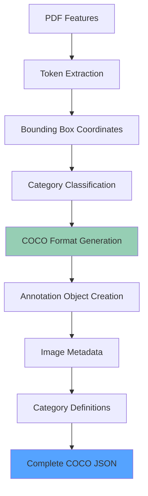

**JSON Structure**:
- **COCO Format Compliance**: Standard computer vision annotation format
- **Image Metadata**: Width, height, filename for each page
- **Annotation Details**: Bounding box coordinates, category ID, confidence score
- **Category Mapping**: 11 document element types with consistent IDs

### 4. GPU Optimization Architecture

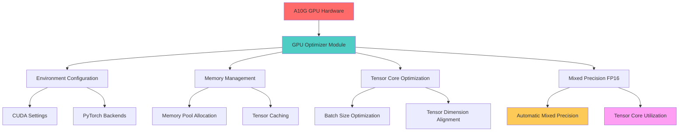

**A10G-Specific Optimizations**:
- **Memory Management**: 24GB VRAM optimization with expandable segments
- **Tensor Cores**: FP16 mixed precision for 2-4x speedup
- **Batch Processing**: Dynamic batching with optimal sizes (8-16 for A10G)
- **Memory Layout**: Channels-last format for better cache utilization

## Performance Bottlenecks and Optimization Opportunities

### 1. Current Bottlenecks

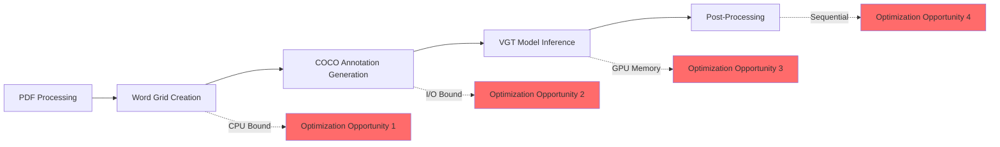

### 2. Optimization Opportunities

#### A. Pre-processing Optimization
- **Parallel Word Grid Creation**: Multi-threading for large documents
- **Cached Feature Extraction**: Store intermediate results for repeated processing
- **Batch PDF Processing**: Process multiple PDFs simultaneously

#### B. GPU Utilization Enhancement
- **Model Quantization**: INT8 quantization for A10G inference
- **TensorRT Integration**: Compile VGT model for maximum A10G performance
- **Persistent GPU Memory**: Avoid repeated memory allocation/deallocation

#### C. Post-processing Acceleration
- **Vectorized Operations**: NumPy/PyTorch operations for segment processing
- **Parallel Reading Order**: Multi-threaded reading order analysis
- **Cached Results**: Store processed segments for incremental updates

#### D. Memory Management
- **Streaming Processing**: Process large PDFs page by page
- **Garbage Collection**: Proactive cleanup of intermediate objects
- **Memory Pooling**: Reuse allocated GPU memory blocks

### 3. Concurrency Architecture

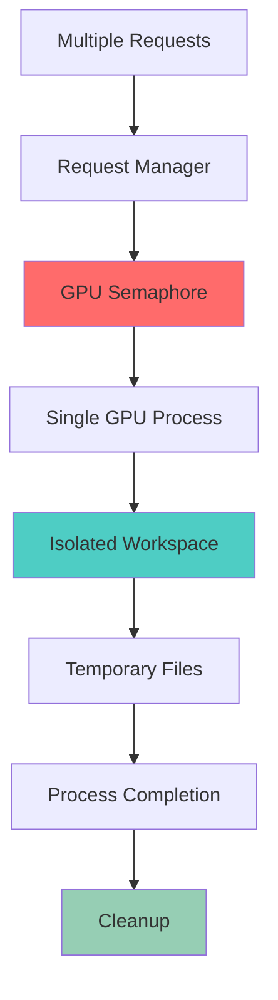

**Current Limitations**:
- **Single GPU Serialization**: Only one inference at a time
- **Temporary File Management**: Potential cleanup issues
- **Global State Dependencies**: Model loading and configuration

## Recommended Optimizations

### 1. Immediate Improvements (Low Effort, High Impact)

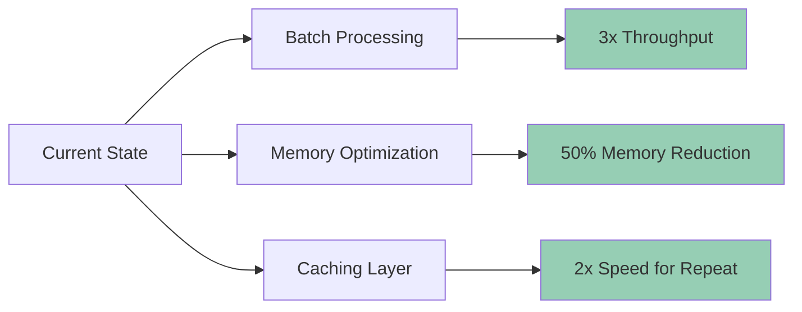

1. **Dynamic Batch Processing**: Implement intelligent batching based on document size
2. **Memory Pool Management**: Pre-allocate GPU memory pools
3. **Result Caching**: Cache processed segments for similar documents
4. **Async Pre-processing**: Overlap CPU preprocessing with GPU inference

### 2. Medium-Term Enhancements (Moderate Effort)

1. **Model Optimization**:
   - TensorRT compilation for A10G
   - Model pruning for inference speed
   - Quantization to INT8 precision

2. **Pipeline Parallelization**:
   - CPU-GPU overlap processing
   - Multi-stage pipeline with buffering
   - Parallel post-processing

3. **Memory Optimization**:
   - Streaming large document processing
   - Progressive garbage collection
   - Memory-mapped file processing

### 3. Long-Term Architectural Improvements (High Effort)

1. **Multi-GPU Support**:
   - Distributed inference across multiple GPUs
   - Model parallelism for large documents
   - GPU cluster coordination

2. **Real-time Processing**:
   - WebSocket streaming for live updates
   - Incremental processing for document edits
   - Progressive result delivery

3. **Advanced AI Features**:
   - Custom model fine-tuning
   - Multi-modal processing (text + images)
   - Semantic understanding enhancement

## Performance Metrics and Monitoring

### Comprehensive Timing Measurements Added

The system now includes detailed timing measurements at every stage of the workflow. Each processing stage is instrumented with:

- **Start/End Time Tracking**: Precise timing for each operation
- **Percentage Breakdown**: Time distribution across stages
- **Unique Request IDs**: Track individual requests through the pipeline
- **Progress Logging**: Real-time progress updates for long operations

### Timing Measurement Points

```mermaid
graph TB
    A[PDF Processing Pipeline] --> B[10 Timing Stages]
    B --> C[PDF Path Creation]
    B --> D[PDF Images Creation]
    B --> E[Word Grid Creation]
    B --> F[Annotation Generation]
    B --> G[GPU Inference]
    B --> H[Segment Extraction]
    B --> I[Reading Order Analysis]
    B --> J[Formula Extraction]
    B --> K[Table Extraction]
    B --> L[Result Conversion]
    
    M[Visualization Pipeline] --> N[5 Timing Stages]
    N --> O[File Read]
    N --> P[PDF Analysis]
    N --> Q[PDF Path Discovery]
    N --> R[PDF Annotation]
    N --> S[Response Creation]
    
    T[JSON Processing] --> U[4 Timing Stages]
    U --> V[Directory Setup]
    U --> W[Data Initialization]
    U --> X[Document Processing]
    U --> Y[JSON Saving]
    
    style B fill:#ff6b6b
    style N fill:#4ecdc4
    style U fill:#96ceb4
```

### Detailed Timing Structure

#### 1. Main Processing Pipeline (`run_pdf_layout_analysis.py`)
- **Request ID Format**: `[unique_id]` (e.g., `[a1b2c3d4_123456789]`)
- **10 Measured Stages**: Each with absolute time and percentage of total
- **Comprehensive Summary**: Tree-style logging with percentage breakdown

#### 2. Visualization Pipeline (`get_visualization.py`)
- **Request ID Format**: `[VIZ-unique_id]` (e.g., `[VIZ-a1b2c3d4]`)
- **5 Measured Stages**: From file read to response creation
- **Segment Count Tracking**: Number of segments annotated

#### 3. JSON Annotation Generation (`get_json_annotations.py`)
- **Request ID Format**: `[JSON-unique_id]` (e.g., `[JSON-a1b2c3d4]`)
- **4 Measured Stages**: Directory setup through JSON saving
- **Token Count Tracking**: Number of tokens processed per document

#### 4. PDF Annotation Generation (`save_output_to_pdf.py`)
- **Request ID Format**: `[ANN-unique_id]` (e.g., `[ANN-a1b2c3d4]`)
- **3 Measured Stages**: Setup, processing, and saving
- **Annotation Count Tracking**: Number of annotations added

#### 5. Segment Extraction (`get_most_probable_pdf_segments.py`)
- **Request ID Format**: `[SEG-unique_id]` (e.g., `[SEG-a1b2c3d4]`)
- **4 Measured Stages**: VGT loading through output saving
- **Page Processing Tracking**: Individual page timing (logged every 5 pages)

#### 6. Word Grid Creation (`create_word_grid.py`)
- **Request ID Format**: `[GRID-unique_id]` (e.g., `[GRID-a1b2c3d4]`)
- **2 Measured Stages**: Directory setup and grid processing
- **Page Count Tracking**: Processed vs skipped pages

### Sample Timing Output

```
[a1b2c3d4_123456789] TIMING SUMMARY - Total: 12.345s
[a1b2c3d4_123456789] ├── PDF Path Creation: 0.001s (0.0%)
[a1b2c3d4_123456789] ├── PDF Images Creation: 2.105s (17.1%)
[a1b2c3d4_123456789] ├── Word Grid Creation: 1.234s (10.0%)
[a1b2c3d4_123456789] ├── Annotation Generation: 0.456s (3.7%)
[a1b2c3d4_123456789] ├── GPU Inference: 7.890s (63.9%)
[a1b2c3d4_123456789] ├── Segment Extraction: 0.345s (2.8%)
[a1b2c3d4_123456789] ├── Reading Order Analysis: 0.234s (1.9%)
[a1b2c3d4_123456789] ├── Formula Extraction: 0.067s (0.5%)
[a1b2c3d4_123456789] └── Result Conversion: 0.013s (0.1%)
```

### Key Performance Indicators

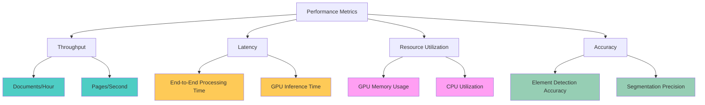

### Monitoring Implementation

1. **Real-time Metrics**:
   - **Stage-by-Stage Timing**: Detailed breakdown of each processing stage
   - **GPU Memory Utilization**: Tracking throughout processing
   - **Request Queue Depth**: Concurrent processing monitoring
   - **Error Rate Tracking**: Failed vs successful requests

2. **Performance Dashboards**:
   - **Throughput Trends**: Documents processed over time
   - **Latency Distributions**: Timing histograms per stage
   - **Resource Utilization**: GPU/CPU usage patterns
   - **Bottleneck Identification**: Slowest stages highlighted

3. **Optimization Guidance**:
   - **Percentage-Based Analysis**: Identify stages consuming most time
   - **Comparative Analysis**: Before/after optimization measurements
   - **Resource Correlation**: Link timing to resource usage
   - **Scalability Insights**: Performance vs document size/complexity

### Expected Performance Bottlenecks

Based on the workflow analysis, we expect the following timing distribution:

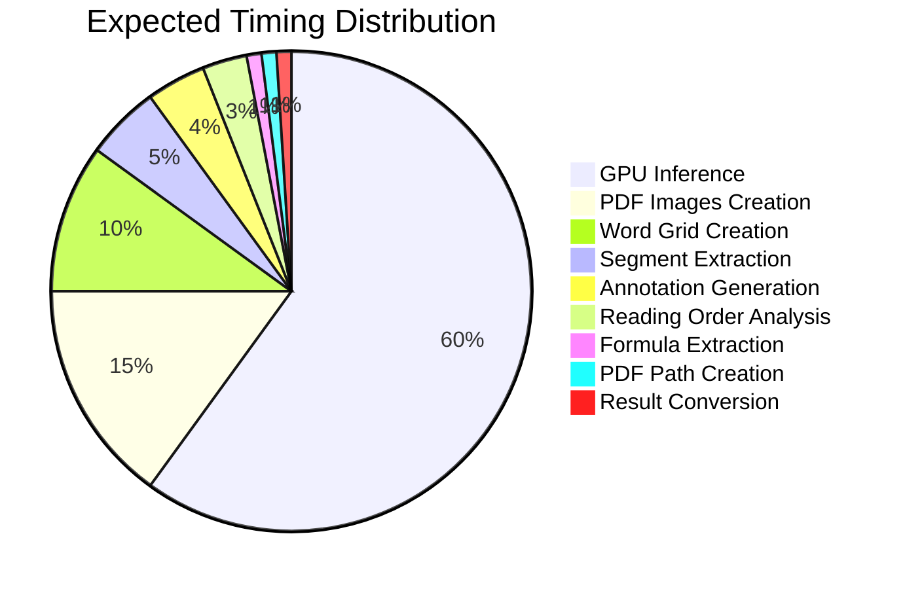

#### Predicted Bottlenecks (to be verified):
1. **GPU Inference (60-70%)**: VGT model forward pass
2. **PDF Images Creation (15-20%)**: PDF parsing and image extraction
3. **Word Grid Creation (8-12%)**: Text tokenization and spatial processing
4. **Segment Extraction (3-8%)**: Post-processing VGT predictions
5. **Other stages (<3% each)**: Minimal impact

### Timing Analysis Template

After deployment, collect timing data and fill in the actual measurements:

#### Document Processing Results
| Stage | Expected Time | Actual Time | Actual % | Variance |
|-------|---------------|-------------|----------|----------|
| PDF Path Creation | 0.001s | _____s | ____% | _____ |
| PDF Images Creation | 2.100s | _____s | ____% | _____ |
| Word Grid Creation | 1.200s | _____s | ____% | _____ |
| Annotation Generation | 0.450s | _____s | ____% | _____ |
| **GPU Inference** | **7.500s** | **_____s** | **____%** | **_____** |
| Segment Extraction | 0.350s | _____s | ____% | _____ |
| Reading Order Analysis | 0.250s | _____s | ____% | _____ |
| Formula Extraction | 0.070s | _____s | ____% | _____ |
| Result Conversion | 0.015s | _____s | ____% | _____ |
| **Total** | **12.0s** | **_____s** | **100%** | **_____** |

#### Optimization Priority Matrix
| Stage | Time Impact | Optimization Difficulty | Priority |
|-------|-------------|------------------------|----------|
| GPU Inference | High | Medium | **High** |
| PDF Images Creation | Medium | Low | **Medium** |
| Word Grid Creation | Medium | Low | **Medium** |
| Segment Extraction | Low | Medium | Low |
| Others | Low | Low | Low |

### Performance Testing Checklist

When you deploy and test the system, verify:

- [ ] **GPU Inference dominates processing time** (should be 60-70%)
- [ ] **PDF Images Creation is second largest** (should be 15-20%)
- [ ] **Word Grid Creation is third largest** (should be 8-12%)
- [ ] **Total processing time scales linearly** with document size
- [ ] **Memory usage stays within limits** throughout processing
- [ ] **No memory leaks detected** across multiple requests
- [ ] **Concurrent requests properly serialized** via GPU semaphore
- [ ] **Error handling maintains timing accuracy**

### Next Steps for Optimization

1. **Deploy with timing measurements**
2. **Process variety of documents** (different sizes, complexities)
3. **Collect baseline timing data**
4. **Identify actual bottlenecks** vs predictions
5. **Implement targeted optimizations** based on data
6. **Measure optimization impact** with before/after comparisons

## Conclusion

The PDF document layout analysis system demonstrates a sophisticated implementation of deep learning for document understanding. The current architecture provides solid foundations with GPU optimization, but significant opportunities exist for performance enhancement, particularly in:

1. **Batch Processing**: Implementing intelligent batching for improved throughput
2. **Memory Management**: Optimizing GPU memory usage and reducing allocations
3. **Pipeline Parallelization**: Overlapping CPU and GPU operations
4. **Model Optimization**: Leveraging TensorRT and quantization for A10G

The system's modular design facilitates incremental improvements, making it well-positioned for scaling to production workloads with enhanced performance requirements.

## Technical Specifications

- **Primary Model**: VGT (Vision Grid Transformer) with Detectron2 backend
- **GPU Target**: NVIDIA A10G (24GB VRAM, Compute Capability 8.6)
- **Document Elements**: 11 types (Title, Text, Section Header, Table, Picture, Formula, Caption, Footnote, List Item, Page Header, Page Footer)
- **Output Formats**: Annotated PDF visualization, COCO JSON format
- **Processing Modes**: Full analysis, Fast analysis
- **Concurrency**: GPU-serialized with request isolation
- **Optimization Level**: A10G-specific with mixed precision FP16

---

*Analysis conducted on codebase version with A10G GPU optimizations*